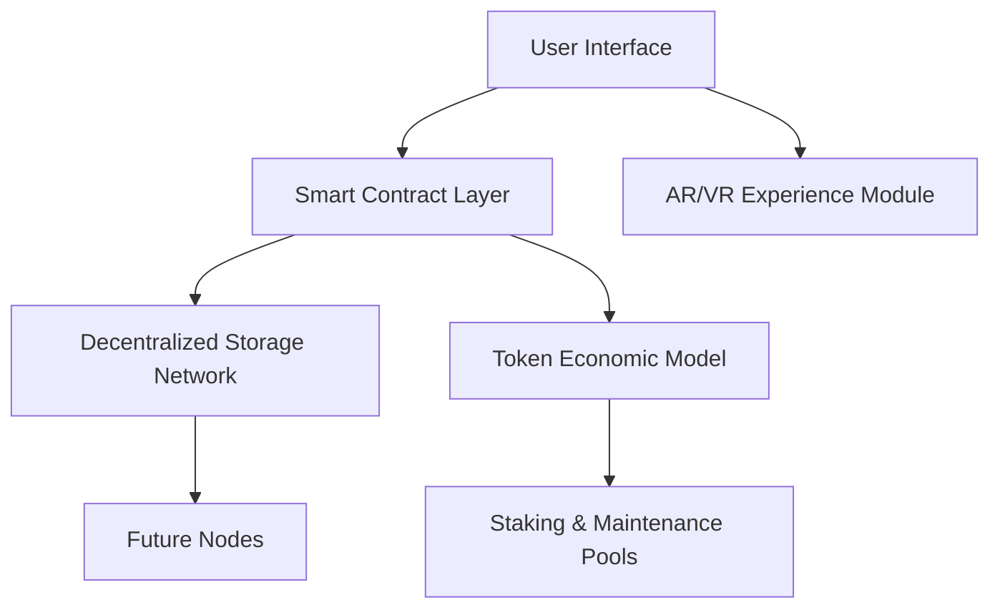

# Temporal Vault: Decentralized Autonomous Time Capsule Platform

## Overview

Temporal Vault is a groundbreaking blockchain-powered platform that revolutionizes how we preserve, store, and deliver messages across time. By leveraging decentralized technologies, smart contracts, and innovative tokenization mechanisms, we create a secure, immutable system for transmitting digital time capsules.

## Key Features

### 🕰️ Smart Time-Locking Mechanisms
- Precise scheduling of future message deliveries
- Cryptographically secured time-release protocols
- Flexible time-locking options from months to centuries

### 🔐 Decentralized Storage and Integrity
- Distributed network of "Future Nodes" ensuring message preservation
- Redundant storage across multiple blockchain nodes
- Cryptographic proofs of data integrity and non-tampering

### 💎 Tokenized Maintenance Model
- Native utility token for long-term data storage maintenance
- Economic incentives for node operators
- Staking mechanisms to ensure network reliability

### 👥 Advanced Beneficiary Systems
- Multiple inheritance and access control layers
- Granular permissions for message access
- Dead man's switch and multi-signature recovery options

### 🌐 Immersive Experience Layers
- AR/VR integration for interactive time capsule exploration
- Multimedia support for rich, context-aware message delivery
- Verifiable provenance and authenticity tracking

## Architecture



## Technology Stack

- **Blockchain**: Stacks (Proof of Transfer)
- **Smart Contract Development**: Clarinet
- **Smart Contract Language**: Clarity
- **Frontend**: React with Web3 integration
- **AR/VR**: WebXR, Three.js
- **Storage**: IPFS, Decentralized File Systems

## Development Roadmap

1. **Alpha Phase**
    - Core smart contract development
    - Basic time-locking mechanisms
    - Initial node network setup

2. **Beta Phase**
    - Advanced beneficiary systems
    - Token economic model implementation
    - AR/VR prototype integration

3. **Production Phase**
    - Full network launch
    - Enterprise and personal use cases
    - Global node network expansion

## Smart Contract Testing

Use Clarinet for comprehensive testing:

```bash
# Run contract unit tests
clarinet test

# Test time-locking mechanisms
clarinet test --focus time-lock

# Verify beneficiary access protocols
clarinet test --focus beneficiary-access
```

## Getting Started

### Prerequisites
- Node.js (v16+)
- Stacks Wallet
- Clarinet CLI
- Web3-compatible browser

### Installation
```bash
# Clone the repository
git clone https://github.com/your-org/temporal-vault.git

# Install dependencies
npm install

# Set up Clarinet environment
clarinet integrate
```

## Security Considerations

- Multi-layer encryption for stored messages
- Quantum-resistant cryptographic protocols
- Regular security audits and bug bounty programs
- Transparent governance model

## Contributing

We welcome contributions! Please see `CONTRIBUTING.md` for details on our code of conduct and the process for submitting pull requests.

## License

This project is licensed under the MIT License - see the `LICENSE.md` file for details.

## Contact

- **Project Lead**: [Your Name]
- **Email**: temporal-vault@example.com
- **Discord**: https://discord.gg/temporalvault

---

*Preserving humanity's stories, one block at a time.*
